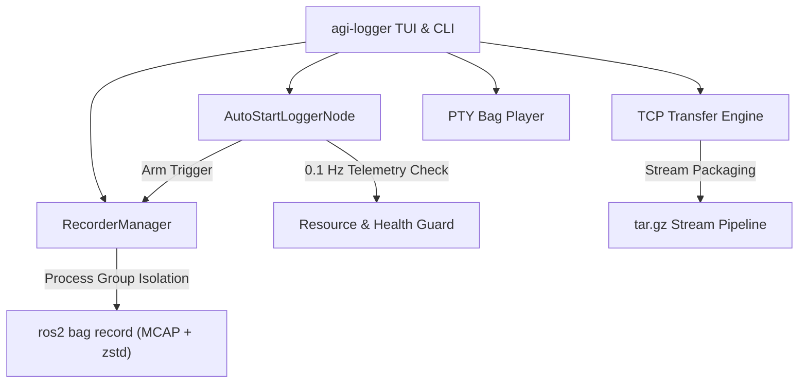

# `agi-logger`

```
      █████╗  ██████╗ ██╗██████╗ ██╗██╗  ██╗ 
     ██╔══██╗██╔════╝ ██║██╔══██╗██║╚██╗██╔╝ 
     ███████║██║  ███╗██║██████╔╝██║ ╚███╔╝  
     ██╔══██║██║   ██║██║██╔═══╝ ██║ ██╔██╗  
     ██║  ██║╚██████╔╝██║██║     ██║██╔╝ ██╗ 
     ╚═╝  ╚═╝ ╚═════╝ ╚═╝╚═╝     ╚═╝╚═╝  ╚═╝ 

██╗      ██████╗  ██████╗  ██████╗ ███████╗██████╗ 
██║     ██╔═══██╗██╔════╝ ██╔════╝ ██╔════╝██╔══██╗
██║     ██║   ██║██║  ███╗██║  ███╗█████╗  ██████╔╝
██║     ██║   ██║██║   ██║██║   ██║██╔══╝  ██╔══██╗
███████╗╚██████╔╝╚██████╔╝╚██████╔╝███████╗██║  ██║
╚══════╝ ╚═════╝  ╚═════╝  ╚═════╝ ╚══════╝╚═╝  ╚═╝
    Production ROS 2 Logging & Network Transport Utility for Agipix Platform
```

**`agi-logger` v1.0** is a robotics-tailored telemetry recording, network distribution, and playback management framework for ROS 2. It unifies high-throughput `rosbag2` recording (MCAP + ZSTD compression), autonomous drone arm/disarm lifecycle automation, real-time hardware health guards (0.1 Hz RAM & disk monitoring), a full terminal UI (TUI), and socket-level TCP batch bag transfers.

---

## 🌟 Release 1.0 Highlights

- **Interactive Topic Checklist**: Select topics directly from [`cfg/topics_of_interest.yaml`](cfg/topics_of_interest.yaml) using an interactive checkbox tick list (`t` in Record menu).
- **Autonomous Flight Trigger & Manual Recording**: Supports both telemetry-driven autostart (Aerostack2/PX4) and direct foreground manual recording with unified controls.
- **Hardware Health Monitoring at 0.1 Hz**: Real-time RAM and disk usage tracking every 10 seconds in both autostart and manual recording modes, with colorized warnings (red) and automatic emergency stop on critical resource exhaustion.
- **Interactive Navigation Controls**: Press **`m`** to return to the interactive main menu or **`q`** to cleanly stop recording/monitoring and exit.
- **Queue-Starvation Prevention in Playback**: Pre-configured `--read-ahead-queue-size 10000` eliminates stuttering and warnings during compressed bag playback.
- **TCP Multi-Bag Batch Transfer**: Interactive checkbox selector for transferring multiple bag directories in a single connection with live progress metrics and inline Host/Port editing.
- **Process Group Isolation**: Recorder child processes run in isolated process groups (`start_new_session=True`), preventing orphaned rosbag processes on exit.

## 🌟 Release 1.2 Highlights

### 1. Direct Socket Streaming for Directory Bags (Zero Latency & 0 Disk Overhead)
- **Eliminated Pre-Archiving Latency**: Bag directory archives are now streamed directly into the TCP socket on-the-fly using chunked framing and streaming tar (`mode="w|"`).
- **Instant Transfer Startup**: Reduced initial delay from **>3 minutes to <5 ms** on multi-gigabyte bags, resolving the 60-second client connection timeout (`TimeoutError: timed out`).
- **Zero Temporary Disk Usage**: Removed temporary `.tar.gz` creation and extraction in `/tmp`, eliminating gigabytes of redundant disk read/write churn.

### 2. Bidirectional Version Handshake Check
- Added an automatic version handshake (`AGI_LOGGER_VERSION:<version>`) during TCP connection initialization.
- Prominently alerts operators if connecting between mismatched versions or legacy clients that might cause transfer corruption due to protocol differences.

### 3. CLI & Packaging Improvements
- Added `agi-logger --version` command-line flag.
- Full support for mixed batch transfers (nested bag directories alongside standalone log files).


---

## ⚡ One-Liner Quick Reference

### 🔴 Bag Recording Commands

| Task | One-Liner Command |
| :--- | :--- |
| **Interactive TUI Main Menu** | `agi-logger` |
| **Foreground Recording (Active Terminal)** | `agi-logger record start` |
| **Headless Background Recording** | `agi-logger record start --background` |
| **Stop Active Background Recording** | `agi-logger record stop` |
| **Query Recording Status & PID** | `agi-logger record status` |
| **Autonomous Drone Arming Logger** | `agi-logger ros2 autostart` |
| **Record with Custom Config File** | `agi-logger --config /path/to/custom_configs.yaml record start` |

---

### 🌐 TCP Network Transfer Commands

| Task | One-Liner Command |
| :--- | :--- |
| **Send Single Bag / File (Server)** | `agi-logger tcp send --file /path/to/bag_folder --port 6000` |
| **Send Multiple Bags in Batch (Server)** | `agi-logger tcp send --file /path/to/bag1 /path/to/bag2 /path/to/bag3 --port 6000` |
| **Interactive Multi-Select Checklist (Server)** | `agi-logger tcp send` *(launches interactive tick list)* |
| **Send with Custom Bind Host & Port** | `agi-logger tcp send --host 0.0.0.0 --port 7000 --file /path/to/bag` |
| **Receive Bag(s) to Target Directory (Client)** | `agi-logger tcp receive --host 192.168.1.100 --port 6000 --dest /path/to/storage` |
| **Receive to Current Directory (Client)** | `agi-logger tcp receive --host 192.168.1.100 --port 6000` |
| **Run Default Configured Mode (`server`/`client`)** | `agi-logger tcp run` |

---

### ⏯️ Playback & Settings Commands

| Task | One-Liner Command |
| :--- | :--- |
| **Interactive Bag Playback Selector** | `agi-logger play` *(press `t` to toggle `--clock`)* |
| **Bag Playback from Specific Directory** | `agi-logger play --path /workspaces/logging/test_bags` |
| **Direct Bag Playback (Rate & Loop Controls)** | `agi-logger bag play /path/to/bag --rate 1.5 --loop` |
| **Bag Playback with Clock Topic (Default)** | `agi-logger bag play /path/to/bag --clock` |
| **Bag Playback without Clock Topic** | `agi-logger bag play /path/to/bag --no-clock` |
| **Bag Playback with Custom Pre-fetch Queue** | `agi-logger bag play /path/to/bag --read-ahead-queue-size 10000` |
| **Direct Configuration Editor** | `agi-logger settings` |

---

## 📋 Topics of Interest Catalogue (`cfg/topics_of_interest.yaml`)

The catalogue provides standard topic mappings configured for Agipix robotics platforms:

| Identifier | Topic Name | Message Type |
| :--- | :--- | :--- |
| `lidar_scan` | `/drone0/livox/lidar` | `sensor_msgs/msg/PointCloud2` |
| `lidar_imu` | `/drone0/livox/imu` | `sensor_msgs/msg/Imu` |
| `realsense_color` | `/drone0/RealSense_Camera/color/image_raw` | `sensor_msgs/msg/Image` |
| `realsense_depth` | `/drone0/RealSense_Camera/depth` | `sensor_msgs/msg/PointCloud2` |
| `realsence_camera_info`| `/drone0/RealSense_Camera/color/camera_info`| `sensor_msgs/msg/CameraInfo` |
| `realsence_depth_info` | `/drone0/RealSense_Camera/depth/camera_info`| `sensor_msgs/msg/CameraInfo` |
| `rgb1_image_raw` | `/rgb1/image_raw` | `sensor_msgs/msg/Image` |
| `rgb1_camera_info` | `/rgb1/camera_info` | `sensor_msgs/msg/CameraInfo` |
| `px4_sensor_combined` | `/fmu/out/sensor_combined` | `px4_msgs/msg/SensorCombined` |
| `px4_imu_processed` | `/drone0/px4_imu` | `sensor_msgs/msg/Imu` |
| `LIO_odometry` | `/drone0/adaptive_lio/state/odom` | `nav_msgs/msg/Odometry` |
| `LIO_path` | `/drone0/adaptive_lio/odometry_path` | `nav_msgs/msg/Path` |
| `LIO_sparce_cloud` | `/drone0/adaptive_lio/scan_sparce` | `sensor_msgs/msg/PointCloud2` |
| `LIO_map_cloud` | `/drone0/adaptive_lio/map_cloud` | `sensor_msgs/msg/PointCloud2` |
| `LIO_dence_cloud` | `/drone0/adaptive_lio/scan` | `sensor_msgs/msg/PointCloud2` |
| `gps_global` | `/fmu/out/vehicle_gps_position` | `px4_msgs/msg/VehicleGpsPosition` |
| `odom_pushed_to_px4` | `/fmu/in/vehicle_visual_odometry` | `px4_msgs/msg/VehicleVisualOdometry` |
| `control_mode` | `/fmu/out/vehicle_control_mode` | `px4_msgs/msg/VehicleControlMode` |
| `vehicle_status` | `/fmu/out/vehicle_status` | `px4_msgs/msg/VehicleStatus` |
| `inflated_voxel_map` | `/occupancy_map/inflated_voxel_map` | `sensor_msgs/msg/PointCloud2` |
| `self_localization_pose`| `/drone0/self_localization/pose` | `geometry_msgs/msg/PoseStamped` |
| `navigation_goal` | `/navigation_runner/goal` | `visualization_msgs/msg/MarkerArray` |
| `self_localization_path`| `/drone0/self_localization/path` | `nav_msgs/msg/Path` |
| `offboard_velocity_cmd` | `/offboard_velocity_cmd` | `geometry_msgs/msg/Twist` |
| `px4_actuator_motors` | `/fmu/out/actuator_motors` | `px4_msgs/msg/ActuatorMotors` |
| `tf` | `/tf` | `tf2_msgs/msg/TFMessage` |
| `tf_static` | `/tf_static` | `tf2_msgs/msg/TFMessage` |

---

## 🛠️ Architecture & Subsystems



### 1. Recording Engine (`RecorderManager`)
- **Process Group Isolation**: Executes `ros2 bag record` with `start_new_session=True` so that interrupting or terminating recording safely cleans up all child processes.
- **Storage & Compression**: Native support for `MCAP` storage plugin, `zstd` compression, QoS profile overrides (`--qos-profile-overrides-path`), and maximum duration/size split limits.
- **Metadata Injection**: Generates an atomic `metadata.json` containing operator credentials, hostname, Git commit hash, flight tags, and timestamps.

### 2. Autonomous Autostart & Manual Recording Engine
- **Autonomous Trigger**: Compatible with both Aerostack2 platform telemetry (`as2_msgs/msg/PlatformInfo` on `/drone0/platform/info`) and PX4 autopilot telemetry (`px4_msgs/msg/VehicleStatus` on `/fmu/out/vehicle_status`).
- **Resource Monitoring Guard (0.1 Hz)**:
  - Continuously samples available RAM (from `/proc/meminfo`) and target bag disk storage (via `shutil.disk_usage`) every 10 seconds during both autostart and foreground manual recording.
  - **Low Warning (in Red)**: Raised when Storage < 10.0 GB or RAM < 1.0 GB.
  - **Critical Emergency Safe Stop**: Triggered when Storage < 2.0 GB or RAM < 300 MB, safely executing `manager.stop_recording()` to protect data and system stability.
- **Interactive Navigation Controls (`q` / `m`)**:
  - `[Recording Active / Awaiting Arm] Press 'm' for main menu | 'q' to quit`:
  - Pressing **`m`** stops recording/monitoring safely and opens the interactive main menu.
  - Pressing **`q`** stops recording/monitoring cleanly and exits the application.

### 3. TCP Batch Transfer Engine (`tcp_transfer`)
- **Direct Streaming Pipeline**: Streams bag directory tar archives on-the-fly directly over the TCP socket with chunked framing, extracting in real time onto the receiving client without writing temporary archive files or CPU-heavy compression delays.
- **Batch Transfer Protocol**: Multi-bag transfers (`BATCH:<count>`) synchronized with line-delimited control messages and chunked frame boundaries to prevent socket frame overlap.
- **Interactive Multi-Select Checklist**: Checkbox tick-list with directory navigation and direct inline editing of Host IP and Port on the preview screen.

### 4. Interactive Bag Playback (`_play_menu`)
- Scrollable curses selector listing all recorded bags with size indicators.
- **Interactive Topic Filtering**: After choosing a bag, an interactive checkbox list displays all topics found in the bag (with types and message counts). All topics are **ticked ON by default** (`[x]`), allowing users to selectively tick off conflicting/unwanted topics (such as raw PX4 bridge topics) before playback.
- **Clock Topic Toggle**: Live toggle for `--clock` (default `ON` / `True`) by pressing **`t`** directly in the selector before playing.
- Non-blocking PTY execution: pressing **`q`** stops playback and returns to the list immediately, while preserving standard ROS 2 player keyboard controls (`Space` for pause, `Arrows` for step).
- Pre-configured `--read-ahead-queue-size 10000` eliminates queue starvation warnings on compressed bags.

---

## ⚙️ Configuration Reference (`cfg/configs.yaml`)

```yaml
agi_logger:
  verbosity: INFO
  logger:
    name: test_log                             # Suffix for bag naming (agi_log_YYYYMMDD_HHMMSS_<name>)
    bag_path: /workspaces/logging/test_bags    # Root storage directory
    storage: mcap                              # Storage format: 'mcap' or 'sqlite3'
    compress: true                             # Enable zstd file compression
    duration: 0                                # Max duration in seconds (0 = unlimited)
    max_bag_size: 0                            # Max split size in bytes (0 = unlimited)
    read_ahead_queue_size: 10000               # Playback pre-fetch queue size
    topics:                                    # Explicit list of ROS 2 topics to record
      - /drone0/platform/info
      - /tf
      - /tf_static
      - /drone0/adaptive_lio/state/odom
    topics_regex: ""                           # Optional regular expression matching topics
    exclude_regex: ""                          # Optional regular expression for topics to ignore
    qos_settings: cfg/qos_profiles.yaml        # Sensor QoS overrides
    auto_start: true                           # Enable autonomous arm-trigger
    auto_start_topic: /drone0/platform/info    # Telemetry topic to monitor
    auto_start_behavior: toggle_arm            # 'toggle_arm' (record while armed) or 'start_on_arm'
    allow_tcp_while_logging: false             # Safety lock preventing network transfers during logging

  tcp_file_communication:
    mode: ask                                  # Default mode: 'server', 'client', or 'ask'
    server:
      host: 0.0.0.0                            # Server listening interface
      port: 6000                               # Server listening port
      file_path: /workspaces/logging/test_bags
    client:
      host: 127.0.0.1                          # Target server IP address
      port: 6000                               # Target server port
      destination_path: /workspaces/logging/test_bags # Download destination folder
```

---

## 🧪 Installation & Quality Assurance

### Installation
```bash
# Source ROS 2 Humble and Agipix workspace overlays
source /opt/ros/humble/setup.bash
source /workspaces/agipix_control/install/setup.bash

# Install agi-logger in editable mode
pip install -e /workspaces/logging/src/agi_logger
```

### Running Automated Test Suite
```bash
pytest /workspaces/logging/src/agi_logger/tests -v
```
Output:
```
tests/test_cli_helpers.py::test_parse_values PASSED
tests/test_cli_helpers.py::test_format_display_value PASSED
tests/test_cli_helpers.py::test_build_parser PASSED
tests/test_cli_helpers.py::test_bag_play_command_build PASSED
tests/test_cli_helpers.py::test_get_bag_topics PASSED
tests/test_cli_helpers.py::test_load_topics_catalogue PASSED
tests/test_config.py::test_load_and_save_raw_config PASSED
tests/test_config.py::test_update_nested_value PASSED
tests/test_config.py::test_resolve_paths PASSED
tests/test_logging_manager.py::test_build_command_basic PASSED
tests/test_logging_manager.py::test_build_command_comma_separated_topics PASSED
tests/test_logging_manager.py::test_write_metadata PASSED
tests/test_manual_recording.py::test_system_monitor_ok PASSED
tests/test_manual_recording.py::test_system_monitor_warning PASSED
tests/test_manual_recording.py::test_system_monitor_critical PASSED
tests/test_manual_recording.py::test_manual_recording_already_recording PASSED
tests/test_manual_recording.py::test_manual_recording_press_q PASSED
tests/test_manual_recording.py::test_manual_recording_press_m PASSED
tests/test_manual_recording.py::test_manual_recording_critical_resource_stop PASSED
tests/test_manual_recording.py::test_record_start_background PASSED
tests/test_manual_recording.py::test_record_start_foreground_menu PASSED
tests/test_ros2_node.py::test_get_system_resources PASSED
tests/test_ros2_node.py::test_resource_threshold_constants PASSED
tests/test_tcp_transfer.py::test_get_host_ips PASSED
tests/test_tcp_transfer.py::test_tcp_transfer_single_file PASSED
tests/test_tcp_transfer.py::test_tcp_transfer_directory_bag PASSED
tests/test_tcp_transfer.py::test_tcp_transfer_multiple_bags_batch PASSED
tests/test_tcp_transfer.py::test_tcp_transfer_mixed_batch_with_nested_directories PASSED
tests/test_tcp_transfer.py::test_version_compatibility_check PASSED
============= 29 passed in 1.48s ==============
```
